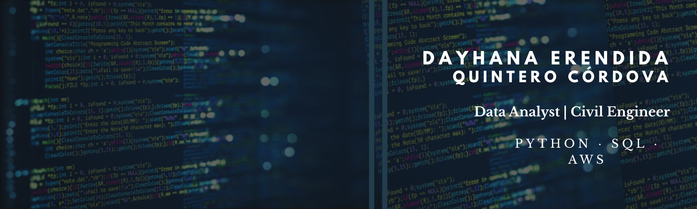

# Hi, I'm Dayhana Quintero 👋

### Data Analyst | Python · SQL · AWS | Civil Engineering Background

Data Analyst focused on transforming data into actionable insights
that drive operational and commercial decision-making.
I build end-to-end analytical projects combining SQL, Python,
and cloud tools to solve real-world business problems.

---

## 🛠️ Tech Stack

---

## 🚀 Featured Projects

| 🚀 Project | 🔍 Description | 🛠️ Tech |
|-----------|----------------|---------|
| [Vehicle Crime Risk Analysis](https://github.com/DayhanaQuintero/vehicle-crime-risk-analysis) | Classification of 32 Mexican states by vehicle crime risk level for an insurance company | Python, SARIMA, K-Means, SQLite, Looker Studio |
| [Sales Analysis & Prediction](https://github.com/DayhanaQuintero/sales-analysis-prediction) | End-to-end sales performance analysis and forecasting by category and region | Python, ARIMA, SQL, AWS, Looker Studio |
| [Real Estate ETL Pipeline](https://github.com/DayhanaQuintero/etl-housing-aws-spark) | Full ETL pipeline on 21,613 housing records using cloud services and Big Data | AWS S3/Glue/Athena, PySpark, SQL |
| [SQL & NoSQL Database Modeling](https://github.com/DayhanaQuintero/database-modeling-sql-nosql) | Relational database design in SQL Server/PostgreSQL and NoSQL integration | SQL Server, PostgreSQL, MongoDB, Python |

---
## 📊 GitHub Stats

---

---

## 🌱 Currently Learning
- Advanced Machine Learning
- Data Storytelling
- Data Engineering best practices

---

## 📫 Let's Connect

- 💼 [LinkedIn](https://linkedin.com/in/dayhana-quintero-data-analyst)
- 🐙 [GitHub Portfolio](https://github.com/DayhanaQuintero)
- 📧 dayhana.quintero@outlook.com
