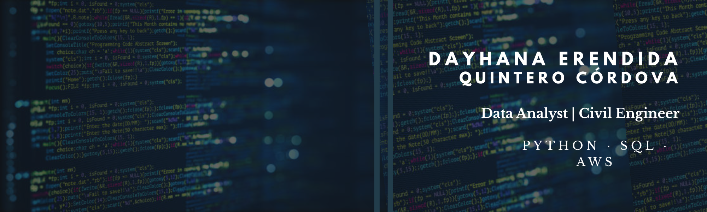

# Hi, I'm Dayhana Quintero 👋

### Data Analyst | Python · SQL · AWS | Data Visualization · ETL · ML  

Data Analyst focused on transforming data into actionable insights that support business decision-making. I develop end-to-end analytical solutions using Python, SQL, and AWS, including data cleaning, exploratory analysis, machine learning models, and data visualization to solve real-world problems.

---

## 🛠️ Tech Stack

---

## 🚀 Featured Projects

| 🚀 Project | 🔍 Description | 🛠️ Tech |
|-----------|----------------|---------|
| [Vehicle Crime Risk Analysis](https://github.com/DayhanaQuintero/vehicle-crime-risk-analysis) | Risk classification of 32 Mexican states using time series and clustering models to support insurance pricing and risk management | Python, SARIMA, K-Means, SQLite, Looker Studio |
| [Sales Analysis & Prediction](https://github.com/DayhanaQuintero/sales-analysis-prediction) | End-to-end sales analysis and forecasting by category and region to support strategic business decisions | Python, ARIMA, SQL, AWS, Looker Studio |
| [Real Estate ETL Pipeline](https://github.com/DayhanaQuintero/etl-housing-aws-spark) | End-to-end ETL pipeline processing 21,613 housing records using AWS and PySpark for scalable data analysis | AWS (S3,Glue,Athena), PySpark, SQL |
| [SQL & NoSQL Database Modeling](https://github.com/DayhanaQuintero/database-modeling-sql-nosql) | Relational database design and NoSQL integration for efficient data storage, querying, and analysis | SQL Server, PostgreSQL, MongoDB, Python |

---

## 🌱 Currently Learning
- Advanced Machine Learning (model optimization & evaluation)
- Data Storytelling for business insights
- Data Engineering (ETL pipelines & cloud architecture)

---

## 📫 Let's Connect

- 💼 [LinkedIn](https://linkedin.com/in/dayhana-quintero-data-analyst)
- 🐙 [GitHub Portfolio](https://github.com/DayhanaQuintero)
- 📧 dayhana.quintero@outlook.com
